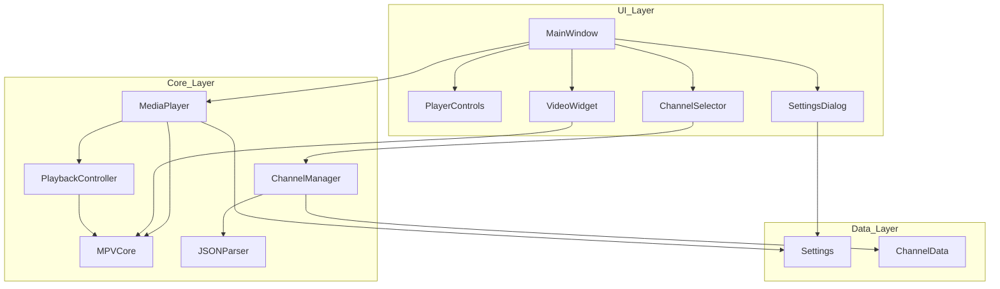
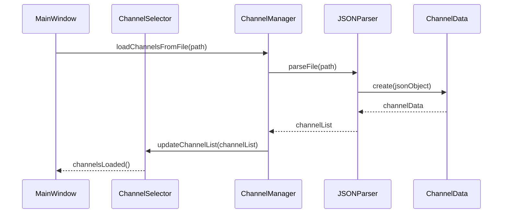
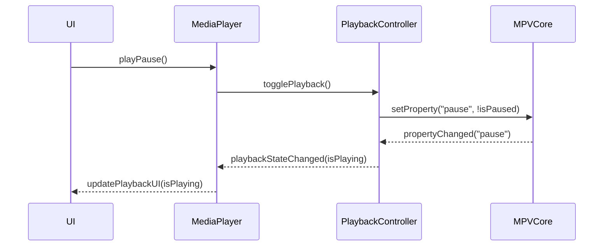
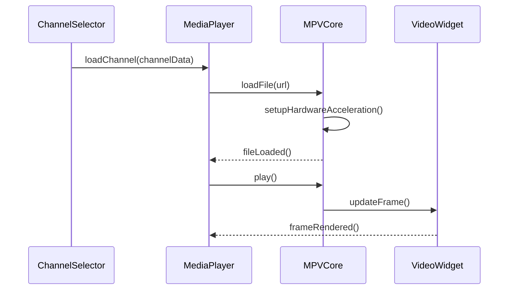
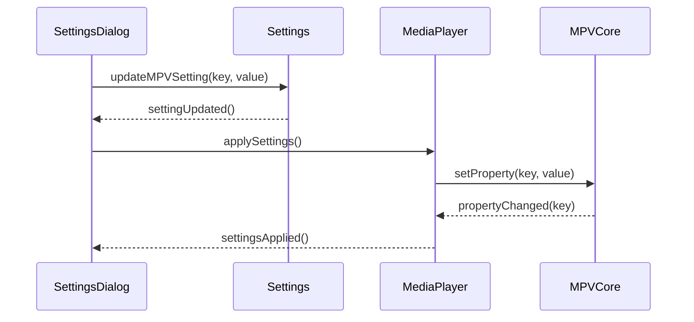

# HarperTV: Qt6-MPV Media Player Architecture

## Overview

HarperTV is a general-purpose media player built with Qt6 and MPV that handles both local files and network streams. It features moderate MPV integration with hardware acceleration support and a simple JSON-based channel selection system.

## 1. High-Level Architecture



### Component Descriptions:

1. **UI Layer**:
   - **MainWindow**: Main application window containing all UI elements
   - **VideoWidget**: Qt widget for rendering video content via MPV
   - **PlayerControls**: UI controls for playback (play/pause, volume, seek, etc.)
   - **ChannelSelector**: Dropdown menu for selecting channels from JSON data
   - **SettingsDialog**: Dialog for configuring MPV and application settings

2. **Core Layer**:
   - **MediaPlayer**: Central controller coordinating playback operations
   - **MPVCore**: Wrapper around libmpv providing video decoding and rendering
   - **PlaybackController**: Manages playback state and controls
   - **ChannelManager**: Manages channel data and selection
   - **JSONParser**: Parses channel data from JSON files

3. **Data Layer**:
   - **Settings**: Stores and manages application and MPV settings
   - **ChannelData**: Represents channel information from JSON

## 2. Recommended Project Structure

```
HarperTV/
├── src/
│   ├── main.cpp                  # Application entry point
│   ├── ui/
│   │   ├── mainwindow.h/cpp      # Main window implementation
│   │   ├── videowidget.h/cpp     # MPV-based video widget
│   │   ├── playercontrols.h/cpp  # Playback control UI
│   │   ├── channelselector.h/cpp # Channel selection UI
│   │   └── settingsdialog.h/cpp  # Settings dialog
│   ├── core/
│   │   ├── mediaplayer.h/cpp     # Core media player logic
│   │   ├── mpvcore.h/cpp         # MPV integration
│   │   ├── playbackcontroller.h/cpp # Playback state management
│   │   ├── channelmanager.h/cpp  # Channel management
│   │   └── jsonparser.h/cpp      # JSON parsing utilities
│   └── data/
│       ├── settings.h/cpp        # Settings management
│       └── channeldata.h/cpp     # Channel data structures
├── resources/
│   ├── icons/                    # Application icons
│   ├── styles/                   # QSS style sheets
│   └── default_channels.json     # Default channel list
├── tests/                        # Unit tests
├── docs/                         # Documentation
├── HarperTV.pro                  # Main qmake project file
├── README.md                     # Project documentation
└── LICENSE                       # License information
```

## 3. Key Classes and Their Responsibilities

### UI Layer

#### `MainWindow` Class
- Main application window
- Integrates all UI components
- Handles menu actions and keyboard shortcuts
- Manages application lifecycle

```cpp
class MainWindow : public QMainWindow {
    // UI components
    VideoWidget* videoWidget;
    PlayerControls* playerControls;
    ChannelSelector* channelSelector;
    
    // Core components
    MediaPlayer* mediaPlayer;
    
    // Methods for UI setup, event handling, etc.
};
```

#### `VideoWidget` Class
- Renders video content using MPV
- Handles video-related events
- Manages aspect ratio and scaling

```cpp
class VideoWidget : public QWidget {
    // MPV rendering surface
    QOpenGLWidget* glWidget;
    
    // Connection to MPV core
    MPVCore* mpvCore;
    
    // Methods for rendering, resizing, etc.
};
```

#### `PlayerControls` Class
- Provides UI controls for playback
- Emits signals for play, pause, seek, etc.
- Updates UI based on playback state

```cpp
class PlayerControls : public QWidget {
    // UI elements
    QPushButton* playPauseButton;
    QSlider* seekSlider;
    QSlider* volumeSlider;
    
    // Signals for control actions
    // Methods for UI updates
};
```

#### `ChannelSelector` Class
- Displays channel list from JSON
- Allows selection of channels
- Emits signals when channel is selected

```cpp
class ChannelSelector : public QComboBox {
    // Reference to channel manager
    ChannelManager* channelManager;
    
    // Methods for populating and handling selection
};
```

#### `SettingsDialog` Class
- Provides UI for configuring settings
- Allows modification of MPV parameters
- Saves settings to configuration

```cpp
class SettingsDialog : public QDialog {
    // UI elements for settings
    // Reference to settings manager
    Settings* settings;
    
    // Methods for loading/saving settings
};
```

### Core Layer

#### `MediaPlayer` Class
- Central controller for media playback
- Coordinates between UI and MPV
- Manages media sources (local/network)

```cpp
class MediaPlayer : public QObject {
    // Core components
    MPVCore* mpvCore;
    PlaybackController* playbackController;
    
    // Current media state
    QString currentMedia;
    bool isNetworkStream;
    
    // Methods for loading media, controlling playback
};
```

#### `MPVCore` Class
- Wraps libmpv functionality
- Handles video decoding and rendering
- Provides interface for MPV commands and properties

```cpp
class MPVCore : public QObject {
    // MPV handle and context
    mpv_handle* mpv;
    
    // Hardware acceleration settings
    
    // Methods for MPV initialization, command execution, property access
};
```

#### `PlaybackController` Class
- Manages playback state
- Handles play/pause/stop logic
- Controls seeking and timing

```cpp
class PlaybackController : public QObject {
    // Reference to MPV core
    MPVCore* mpvCore;
    
    // Playback state
    bool isPlaying;
    double duration;
    double position;
    
    // Methods for controlling playback
};
```

#### `ChannelManager` Class
- Loads and manages channel data
- Provides access to channel information
- Handles channel selection

```cpp
class ChannelManager : public QObject {
    // Channel data
    QList<ChannelData> channels;
    
    // JSON parser
    JSONParser* jsonParser;
    
    // Methods for loading channels, selection, etc.
};
```

#### `JSONParser` Class
- Parses JSON channel data
- Validates JSON structure
- Converts between JSON and application data structures

```cpp
class JSONParser {
    // Methods for parsing JSON files, validating structure
};
```

### Data Layer

#### `Settings` Class
- Stores application settings
- Manages MPV configuration parameters
- Handles persistence of settings

```cpp
class Settings : public QObject {
    // Application settings
    QSettings* appSettings;
    
    // MPV specific settings
    QMap<QString, QVariant> mpvSettings;
    
    // Methods for getting/setting values, loading/saving
};
```

#### `ChannelData` Class
- Represents a channel entry
- Stores channel name and URL
- Provides serialization/deserialization

```cpp
class ChannelData {
    // Channel properties
    QString name;
    QString url;
    
    // Methods for serialization/deserialization
};
```

## 4. Data Flow for Main Operations

### Loading Channels from JSON



### Playback Control Flow



### Loading and Playing Media



### Configuring MPV Settings



## 5. Considerations for Qt6 and MPV Integration

### MPV Integration Approach

1. **libmpv C API Integration**:
   - Use libmpv's C API directly through a C++ wrapper class (MPVCore)
   - Handle MPV events through a Qt event loop integration
   - Map MPV properties to Qt properties for easier binding

2. **Rendering Integration**:
   - Use OpenGL for rendering MPV output
   - Integrate MPV's rendering with Qt's QOpenGLWidget
   - Handle proper context sharing between Qt and MPV

3. **Hardware Acceleration**:
   - Configure MPV to use hardware acceleration based on platform
   - Expose key hardware acceleration parameters in settings
   - Implement fallback mechanisms when hardware acceleration fails

### Qt6 Specific Considerations

1. **Qt6 QML vs Widgets**:
   - Primary architecture uses Qt Widgets for UI
   - Consider optional QML interface for touch-friendly environments

2. **Qt6 Multimedia Integration**:
   - Use Qt6's audio capabilities for additional audio processing if needed
   - Consider fallback to Qt Multimedia for platforms where MPV integration is problematic

3. **Qt6 High DPI Support**:
   - Ensure proper scaling of UI elements on high DPI displays
   - Handle video scaling appropriately for different display densities

4. **Qt6 Threading Model**:
   - Use Qt's threading model for background operations
   - Ensure thread safety when communicating with MPV

## 6. Third-Party Libraries

Beyond Qt6 and MPV, the following libraries may be useful:

1. **libmpv**: Core library for MPV integration
   - Purpose: Video decoding, rendering, and playback control
   - Integration: Direct C API calls through wrapper

2. **nlohmann/json** or **Qt's JSON Support**:
   - Purpose: Parsing and manipulating JSON channel data
   - Integration: Used in JSONParser class

3. **spdlog** or **Qt's Logging Framework**:
   - Purpose: Logging and diagnostics
   - Integration: Used throughout the application for debugging and error reporting

4. **FFmpeg** (indirectly through MPV):
   - Purpose: Additional codec support if needed
   - Integration: MPV already uses FFmpeg internally

5. **OpenGL** (via Qt):
   - Purpose: Hardware-accelerated rendering
   - Integration: Used by VideoWidget for MPV rendering

6. **QTest**:
   - Purpose: Unit testing framework
   - Integration: Used for automated testing of core components

## 7. Implementation Considerations

### JSON Channel Format

A simple example of the expected JSON format for channels:

```json
[
  {
    "name": "Channel 1",
    "url": "http://example.com/stream1.m3u8"
  },
  {
    "name": "Local Media",
    "url": "file:///path/to/video.mp4"
  }
]
```

### MPV Parameter Configuration

Key MPV parameters that should be configurable through the settings:

- Hardware acceleration method (auto, vaapi, vdpau, etc.)
- Video output driver
- Audio output driver
- Cache settings for network streams
- Audio-video sync method
- Network timeout values

### Cross-Platform Considerations

- Windows: Consider using Direct3D for rendering instead of OpenGL
- macOS: Handle Retina display scaling properly
- Linux: Support various hardware acceleration methods (VAAPI, VDPAU)

## 8. Future Extension Points

The architecture is designed to be extensible in the following ways:

1. **Plugin System**: Add a plugin interface for extending functionality
2. **Advanced Playlist Management**: Enhance channel management to support playlists
3. **Remote Control**: Add network-based remote control capabilities
4. **Streaming Output**: Add capability to stream or record media